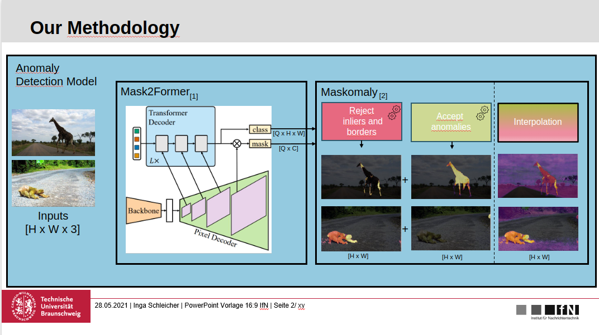
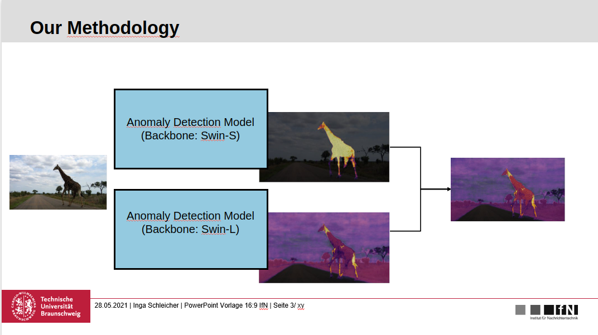
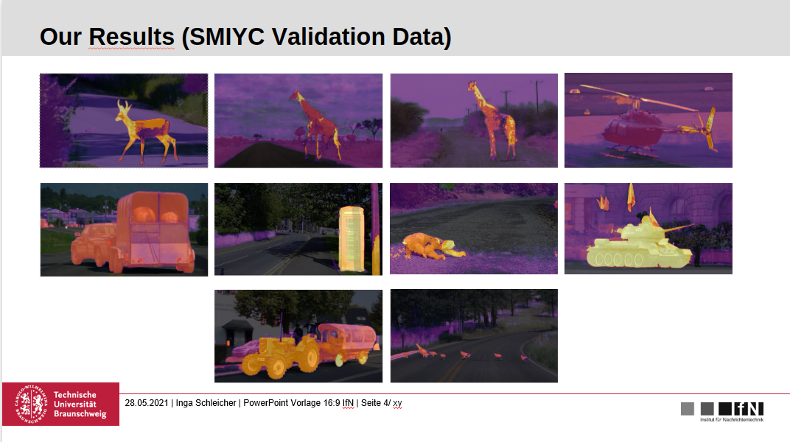
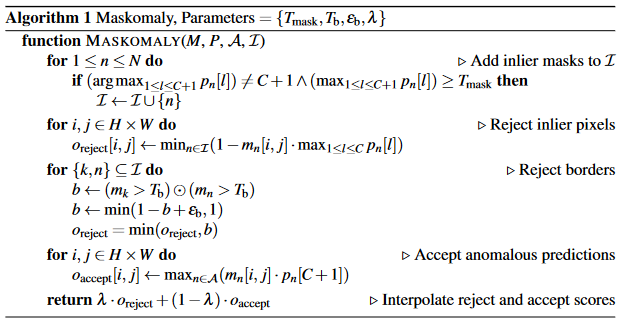

# Description

This repository contains an overview of our [award-winning](https://magazin.tu-braunschweig.de/m-post/das-unbekannte-erkennen/) codebase that was submitted for the Deep Learning Challenge in 2023 organized by the [Institute for Communications Technology](https://www.tu-braunschweig.de/ifn) developed by Emmanuel-Wilson Bauni Kamga, Amira Mahmod-Darwisch, and Emre Gezer (myself). 

Note: This repository only contains the README for reference/showcase purposes. The actual codebase will not be uploaded due to compliance and security considerations, as the solution was developed on the GPU cluster of the institute and we signed NDAs. This repository merely serves as a reference.

## Methodology

Our approach leverages an ensemble of transformer-based segmentation networks combined with postprocessing techniques for dense anomaly detection, introduced in [Maskomaly](https://arxiv.org/abs/2305.16972). Below are visual representations of the methodology and postprocessing steps.




## Quantitative Results (SMIYC-Validation)

| AUPR-sum | AUPR-trapz | FPR95  | F1-Score |
| -------- | ---------- | ------ | -------- |
| 0.9138   | 0.9137     | 0.0451 | 0.8726   |

See `./slurm-550190.out`

## Qualitative Results (SMIYC-Validation): Heatmaps 




# Detailed Description (Submitted)

## Detailed Methodology & how to reproduce results
For this challenge, we trained the S- and the L-configuration of the [Mask2former](https://arxiv.org/abs/2112.01527) segmentation network via the toolkit [MMSegmentation](https://github.com/open-mmlab/mmsegmentation) and implemented the outlier detection algorithm proposed in [Maskomaly](https://arxiv.org/abs/2305.16972).
Our approach involves an ensemble methodology, where inference and dense anomaly detection postprocessing are performed for both architecture configurations. The final anomaly mask is generated by combining the anomaly masks from each model architecture using a weighted combination strategy.
The very first step is to train the segmentation networks, in our case `Mask2Former` with Swin-S and Swin-L backbone. This model is transformer-based and differs from traditional semantic segmentation since it decouples the aspect of localization and classification in segmentation and thus outputs mask predictions and corresponding class scores. Refer to [MaskFormer](https://arxiv.org/abs/2107.06278) and [Mask2Former](https://arxiv.org/abs/2112.01527) to learn more about the used segmentation network. 

Prior work has shown that Mask2Former queries specialize in predicting a certain inlier class with high confidence \[[Maskomaly](https://arxiv.org/abs/2305.16972), [RbA](https://arxiv.org/abs/2211.14293)\] and even in predicting anomalies \[[Maskomaly](https://arxiv.org/abs/2305.16972)]. Maskomaly makes use of that and proposes a two-branch algorithm which assigns anomaly scores based on an interpolation of low inlier scores based on specialized inlier queries and assigns high outlier scores based on specialized anomaly queries. 

The postprocessing algorithm proposed in [Maskomaly](https://arxiv.org/abs/2305.16972):



In order to train the segmentation networks, run:
```
./run_train_mask2former_swin-l.sh
./run_train_mask2former_swin-s.sh
```

This will call the training script provided by [MMSegmentation](https://github.com/open-mmlab/mmsegmentation), an open source semantic segmentation toolbox based on PyTorch. MMSegmentation provides support for various methods out of the box. With its modular design and provided model configurations, MMSegmentation allows to run experiments with different model architectures on datasets of our choice in a time-efficient manner.

You will find the configuration you started the training with, the checkpoint files and the training logs in the directory `work_dirs/`. For a given configuration based on which a training finished successfully, the generated filetree should generally adhere to the following structure (Here: Training with 10.000 iterations only.):

```
📦mask2former_swin-l-in22k-384x384-pre_8xb2-90k_cityscapes-512x1024
 ┣ 📂20230703_235148
 ┃ ┣ 📂vis_data
 ┃ ┃ ┣ 📜20230703_235148.json
 ┃ ┃ ┣ 📜config.py
 ┃ ┃ ┗ 📜scalars.json
 ┃ ┗ 📜20230703_235148.log
 ┣ 📜iter_10000.pth
 ┣ 📜last_checkpoint (symbolic link)
 ┗ 📜mask2former_swin-l-in22k-384x384-pre_8xb2-90k_cityscapes-512x1024.py
```
Note: We saved our final models in `final_model_dir` and manually added artifacts related to the different configurations, e.g. `query_analysis/` (more on that later) and `slurm-*.out`. 

Important for loading the model:
- The config file (e.g. `mask2former_swin-l-in22k-384x384-pre_8xb2-90k_cityscapes-512x1024.py`)
- The checkpoint files (e.g. `iter_360000.pth`)
- The training log (e.g. `20230703_235148.log`)

The next step would be to analyze the queries from our model. We need to get the specialized queries for our dense anomaly detection postprocessing. We need to run:
```shell
sbatch run_analysis.sh
```
To execute the analysis, you need to run two separate scripts: `get_inlier_queries.py` and `get_outlier_queries.py`. Please ensure that you specify the correct paths for the model you wish to analyze queries of within these files.

- `get_inlier_queries.py`: Will run a slurm job on GPU which will output 3 CSV files containing information about how many times a class was predicted (`times_predicted_stats.csv`) by a query, how often it was predicted with a confidence equal or higher than 90% (`high_conf_stats.csv`), and the amount of high confidence predictions relative to the total amount of times a query predicted a certain class. Latter gives us information about which queries are specialized and which are not. If a query predicts a single class with 90% confidence in 90% of the cases, we call a query specialized (`specialized.csv`).  We use the indices of the specialized queries for our postprocessing.
- `get_outlier_queries.py`: Will run a slurm job on GPU which will return queries having an average IoU score above 0.25 across the SMIYC-Validation set.

The indices of the queries will be used to initialize the set of inlier and outlier queries in our postprocessing method. This needs to be done only once after a successful training of our model. The indices are defined in the `DLLSubmission().__init__()` method in `dllsubmission.py`.

Everything needed to load the model, run inference and postprocess for dense anomaly detection is located in `dllsubmission.py`. Please ensure that you specify the correct paths to the model files (when reproducing). The last step would be to run the evaluation:
```shell
sbatch run_eval.sh
```
To plot the resulting anomaly score maps as a heatmap, run:
```shell
sbatch run_plot_heatmaps.sh
```


